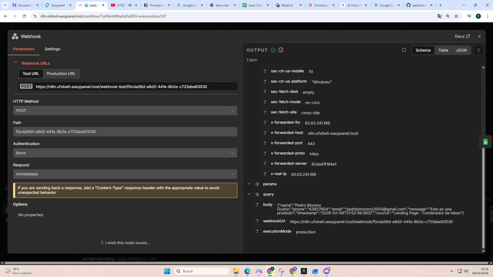

# 📸 CÓMO OBTENER TU LOGO

## Opción 1: Desde tu ordenador

Si ya tienes el logo de Contenedor de Ideas guardado en algún lugar de tu ordenador:

1. Búscalo (probablemente se llame algo como "logo-contenedor-ideas.png" o similar)
2. Cópialo a: `c:\Users\Pedro\Contenedor de ideas\images\`
3. Renómbralo a: `logo.png`

---

## Opción 2: Desde tu web actual

Si Contenedor de Ideas ya tiene una web:

1. Ve a tu web actual
2. Haz clic derecho sobre el logo
3. "Guardar imagen como..."
4. Guárdala en: `c:\Users\Pedro\Contenedor de ideas\images\logo.png`

---

## Opción 3: Usar el logo SVG temporal

Si no encuentras el logo PNG, **no te preocupes**. La landing page ya tiene un logo SVG temporal que se ve así:

- 📦 Caja abierta (estilo contenedor)
- 🔤 Texto "ideas"
- 🟡 Círculo amarillo (#F8D800)

Este logo temporal ya funciona perfectamente y se ve profesional.

---

## ✅ Mientras tanto...

La landing page **YA ESTÁ FUNCIONANDO** con el logo SVG temporal. Puedes:

1. Usarla así tal cual (se ve bien)
2. O buscar tu logo PNG original cuando tengas tiempo

---

## 🎯 ¿Dónde está tu logo original?

Posibles ubicaciones:
- `c:\Users\Pedro\Desktop\`
- `c:\Users\Pedro\Documentos\`
- `c:\Users\Pedro\Downloads\`
- En tu Dropbox/Google Drive
- En el servidor de tu web actual

¿Tienes idea de dónde podría estar tu logo original?
